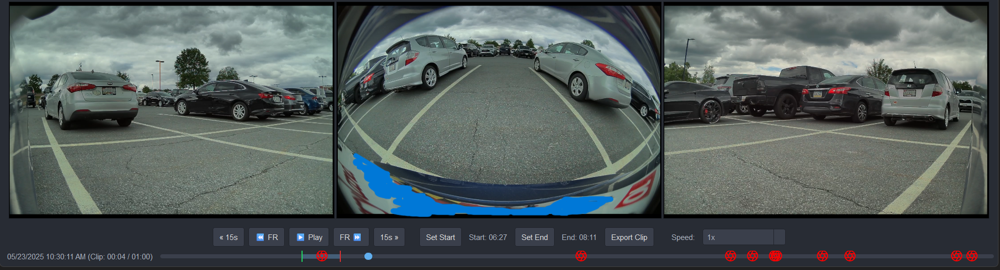
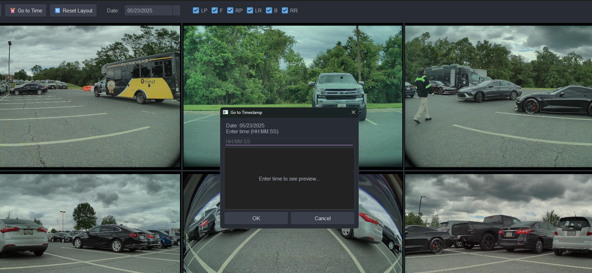

# Sentry‑Six (Electron)

Sentry‑Six is a modern, feature‑rich viewer and exporter for your Tesla Sentry and Dashcam footage — now rewritten in Electron for smoother UI, better multi‑camera sync, and faster exports. It is a ground‑up rewrite in Electron that preserves the core experience while significantly improving performance, reliability, and packaging.


## Community & Support

Have questions, suggestions, or want to connect with other users? Join our official Discord server!

**[Join the TeslaCam Viewer Discord Server](https://discord.com/invite/9QZEzVwdnt)**


## 🚀 What’s New in the Electron Rewrite

- **Smooth, stutter‑free UI** during playback and timeline scrubbing
- **Accurate 6‑camera synchronization** (front, back, left/right repeaters, pillars)
- **Bundled FFmpeg** with automatic detection (no manual install)
- **Hardware acceleration support** when available (NVENC, AMF, QSV, VideoToolbox)
- **Visual export workflow** with custom camera layouts and live estimates
- **Timelapse exports** with speed controls (e.g., 4x → 1200x)
- **Timestamp overlays** with configurable position
- **Robust timeline engine** with event markers and debugging tools
- **Cross‑platform packaging** (Windows/macOS/Linux installers)

## ✨ Features

- **Synchronized 6‑Camera Playback**: Front, Back, Left/Right Repeaters, Left/Right Pillars — all kept in sync by a refined timing model.
- **Interactive Event Markers**: Icons for **Sentry**, **Honk**, and **User‑saved** events on the timeline.
  - 🖱️ **Click to Seek**: Instantly jump to any event; Sentry/User events jump ~10 seconds prior for context.
  - 🖼️ **Hover to Preview**: Preview via `thumb.png` and event reason.
- **Visual Clip Exporting**:
  - 🚩 **Start/End Markers** directly on the timeline for frame‑tight trimming.
  - 🧩 **Custom Camera Layouts**: Arrange cameras freely before export.
  - ⚡ **Hardware Acceleration**: Enables GPU encoding when supported.
  - ⏱️ **Live Estimates**: See export progress, duration, and size predictions.
- **Advanced Playback Controls**:
  - **Variable Speed**: 0.1x–4x
  - **Frame‑by‑Frame**, **15‑Second Skip**, **Volume Control**
  - **Camera Visibility Panel**: Toggle any camera on/off instantly
- **Timelapse & Timestamp Overlay**:
  - Timelapse speeds from 4x up to 1200x
  - Overlay timestamp at bottom/top left/center/right
- **Debug & Diagnostics**:
  - Built‑in **Timeline Debug Panel** (gap detection, missing camera data, file size anomalies)
  - **Export terminal logs** for support

## 📸 Layouts & UI

| Feature | Screenshot |
| :--- | :--- |
| **Event Markers & Tooltip** |  |
| **Draggable Export Markers** |  |
| **All Camera View** |  |
| **Go To Time Dialog** |  |

## 📦 Requirements

- Node.js 18+
- Windows/macOS/Linux
- FFmpeg is bundled with the app; no system install required

## 🧰 Installation (from source)

```bash
npm install
npm start
```

- Development: `npm run dev`
- Build installers: `npm run dist` (outputs to `release/`)

## Installation (prebuilt)

1. Download the latest installer from the Releases page.
2. Run the installer. No Python or system FFmpeg required.
3. (Optional) Pin the app to your taskbar.
4. Use the in‑app update button to check for updates.

## FFmpeg

FFmpeg is bundled under the app’s `ffmpeg_bin/` directory and used automatically. The app falls back to system FFmpeg if needed. No PATH setup required.

## 🛠️ Usage

1. Launch the application.
2. Click **“Open Folder”** and select your `TeslaCam` folder containing `SavedClips/`, `SentryClips/`, or `RecentClips/`.
3. Select a date/event; clips are grouped automatically.
4. Use playback controls and the timeline to browse footage; all visible cameras remain in sync.
5. To export:
   - Set the **Start** and **End** markers on the timeline.
   - Optionally arrange a **Custom Camera Layout**.
   - Choose **Quality** (Full/Mobile), **Hardware Acceleration**, **Timelapse**, and **Timestamp Overlay**.
   - Click **Export** and monitor progress.

## 🔁 Why Electron vs. Python (PyQt6)

| Area | Python (Old) | Electron (New) |
| --- | --- | --- |
| UI Responsiveness | Occasional 1–3s UI freezes during heavy operations | Smooth scrubbing and playback, non‑blocking UI |
| Multi‑Camera Sync | Good, but inconsistent under load | Refined timing model with HTML5 video for consistent alignment |
| Exports | CPU‑heavy, limited GPU use | GPU encoding when available (NVENC/AMF/QSV/VideoToolbox) |
| FFmpeg Handling | External/system dependency | Bundled FFmpeg with automatic detection |
| Packaging | Platform‑specific hurdles | One‑command builds for Win/macOS/Linux |
| Debugging | Limited built‑in diagnostics | Timeline Debug Panel, terminal log export |

For the original Python version and history, see the repository on GitHub: [Sentry‑Six (Python)](https://github.com/ChadR23/Sentry-Six/tree/oldmain).

## ❓ Troubleshooting

- If FFmpeg isn’t detected, ensure platform‑appropriate binaries are present in `ffmpeg_bin/` (Windows: `ffmpeg.exe`, `ffprobe.exe`; macOS: `ffmpeg_bin/mac/`).
- If videos don’t load, verify your Tesla folder structure and that files are `.mp4`.
- On Windows, the app icon is `assets/Sentry_six.ico`.

## 🗺️ Roadmap

This project is actively developed. Here are some ideas for the future:

- [ ] Display GPS data from `event.json` on a map widget.
- [ ] Option to burn‑in camera name labels (e.g., "Front", "Left Repeater") on exported videos.
- [ ] Support for exporting clips as GIFs or image sequences.
- [ ] Drag‑and‑drop support for clip folders.
- [ ] Add Model Y (Juniper) front bumper camera support if/when it’s used for Sentry/Dashcam.

## 🙌 Contributing

Contributions are welcome! Whether it's reporting a bug, suggesting a feature, or writing code, your help is appreciated. Please feel free to open an issue or submit a pull request on the project's GitHub repository.

## 📜 License

This project is licensed under the MIT License - see the [LICENSE](LICENSE) file for details.

## ❤️ Credits

- **Original Concept & Code:** ChadR23
- **Electron Rewrite & Enhancements:** Sentry‑Six Team (with AI assistance)
- **Remaster & Feature Development:** A collaborative effort between Scott and Google's Gemini 2.5 Pro AI.


## 🙏 Special Thanks

- [Scott](https://github.com/Scottmg1), [Parallax](https://github.com/DennisGarvey), and 38tu — for hands‑on beta testing and invaluable feedback.
- ^^^ our incredible beta testers for real‑world feedback, edge‑case reports, and patience while we iterated on the Electron rewrite.
