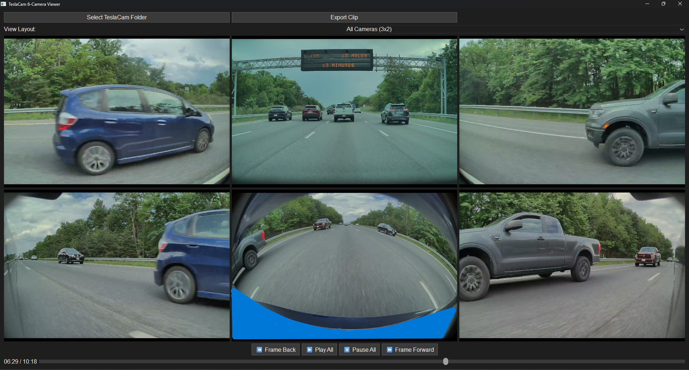
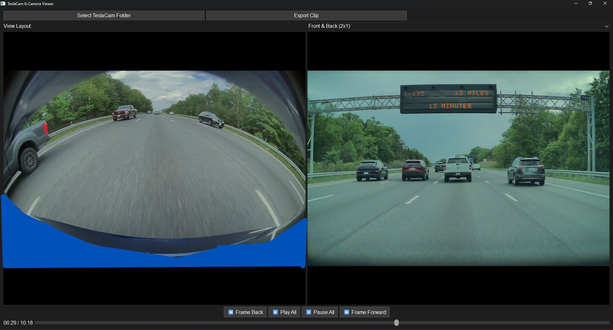
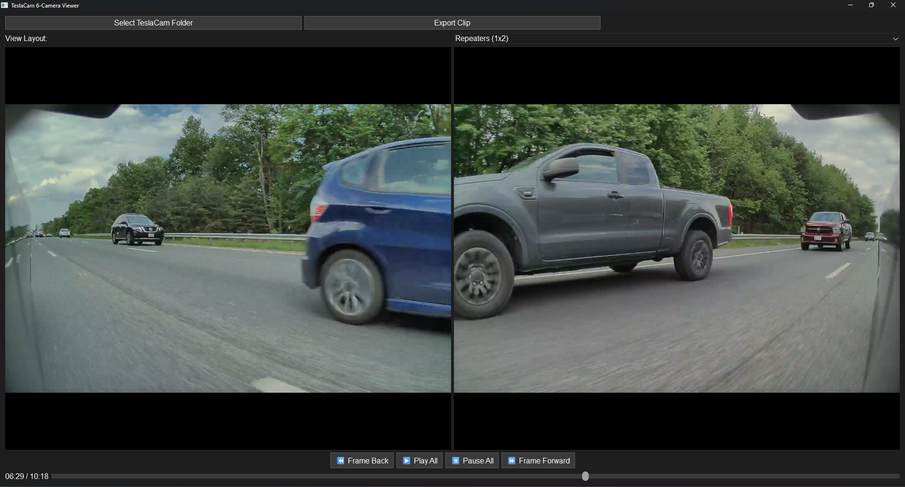
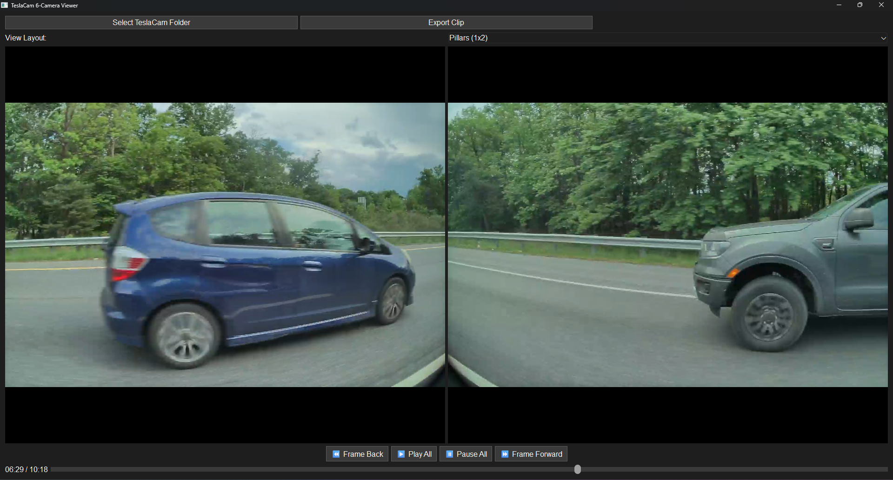
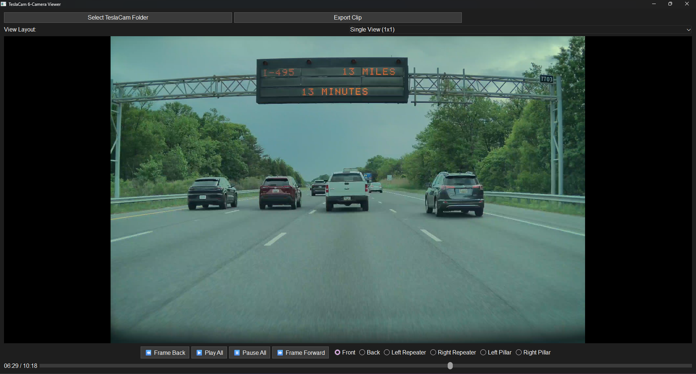

# SentrySix

SentrySix is a multi-camera TeslaCam viewer and exporter built with Python and PyQt6.
It supports synchronized playback of all six Tesla cameras and allows users to export custom clips with frame-accurate trimming and layout control.

---

## 🚗 Features

- 🔭 **6-Camera Playback** — View front, back, repeater, and pillar footage in a synchronized grid
- 🎛️ **Selectable Layouts** — Choose from presets like All Cameras, Front & Back, Repeaters, Pillars, or Single View
- ✂️ **Export Clips** — Trim from any start time and duration, then export the selected layout
- 📱 **Mobile & Full Res Output** — Choose mobile-optimized resolution or original full quality
- 🕐 **Real-Time Timestamps** — Overlay running time synced from Tesla’s clip names
- 🧹 **Auto-Cleanup** — Temporary files are cleaned after export or when the app closes

---

## 📸 Layout Options

- **All Cameras (3x2)**
  > Front / Back / Repeaters / Pillars in a grid layout
  


- **Front & Back (2x1)**
  > Side-by-side stitched view for clean event perspective
  

- **Repeaters (1x2)**
  > Left and Right side views stacked horizontally
  

- **Pillars (1x2)**
  > Left and Right interior pillar cams
  

- **Single View (1x1)**
  > Focus on any one camera — Front, Back, Repeater, or Pillar
  

---

## 🛠 Requirements

- Python 3.10+
- PyQt6
- FFmpeg (must be in system PATH)

Install dependencies:
```bash
pip install -r requirements.txt
```

---

## 🧪 Usage

1. **Launch the app**
2. Click **“Select TeslaCam Folder”** and point to a folder with your Tesla event clips
3. Choose a **layout** (e.g., All Cameras, Front & Back...)
4. Use the playback controls to scrub or sync
5. Click **“Export Clip”** to trim and export
6. Select **start time**, **duration**, **output folder**, and **resolution type**

---

## 📂 Output Files

- `final_output.mp4` — Full resolution export
- `final_output_mobile.mp4` — Optimized for mobile playback
- All `trim_*.mp4` and intermediate files are auto-deleted after export

---
## ⚠️ Disclaimer

SentrySix is an open-source utility provided as-is, with no warranties or guarantees.
By using this software, you accept that you are doing so at your own risk.
The developer is not responsible for any data loss, system behavior, or other unexpected issues that may arise.

Please make backups of your TeslaCam footage before using this tool — especially when trimming or exporting.
---

## 🔒 License

MIT License — See [LICENSE](LICENSE) file

---

## 🚧 Roadmap / Ideas

- [ ] Add support for event.json GPS metadata
- [ ] Option to export overlays with labels (Front, Left Repeater, etc.)
- [ ] GIF or frame sequence exports
- [ ] Drag and drop Tesla folders
- [ ] Add Model Y juniper Front Bumper Camera. (if they ever add it sentry???)

---

## 🙌 Credits

Built with ❤️ by Chad — Inspired by TeslaCam’s incredible capture system

Logo concept: **SentrySix** ⚡